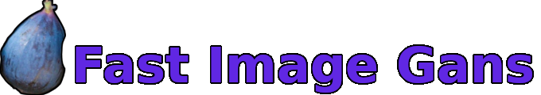
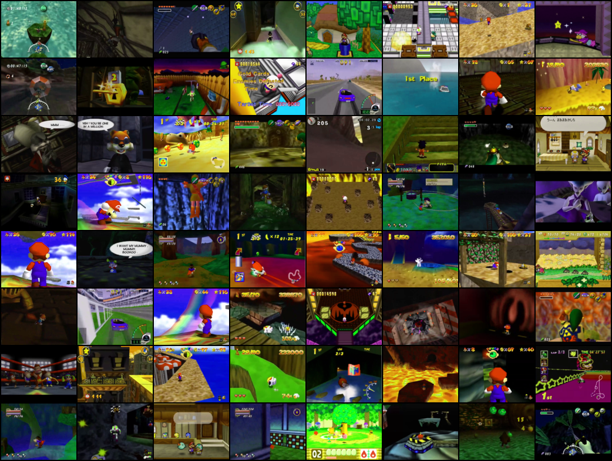
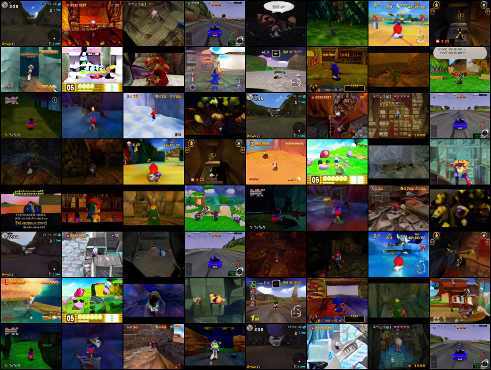

# Game Image Generation
 

[](https://www.python.org/downloads/) [](https://github.com/gcervantes8/Game-Image-Generator/blob/master/LICENSE) [](https://github.com/gcervantes8/Game-Image-Generator/actions/workflows/python-package.yml)


With this project, you can train Generative Adversarial Networks (GANs).  While you can train with any type of image, 
this repository focuses on generating images from games.

## Features

 - PyTorch 2.0 Compile
 - Mixed Precision training
 - Inception Score and FID evaluation
 - Easy to start training
 - Testing

## Datasets
Provided in the code is a sample of the coil-100 dataset, which is used for testing.  You can easily replace this with your own dataset, below are popular datasets used for image generation.

| Dataset | Number of Images | Number of Labels | Resolutions Available | Description |
| - | - | - | - | - |
|[ImageNet](https://www.kaggle.com/c/imagenet-object-localization-challenge/overview/description) | 1m | 1k | varying | Real world objects |
|[CIFAR](https://www.cs.toronto.edu/~kriz/cifar.html) | 60k | 10 or 100 | 32x32 | Real world objects |
|[ArtBench-10](https://github.com/liaopeiyuan/artbench#readme) | 60k | 10 | 32x32, 256x256, or original | Art in 10 distinctive styles |
|[FFHQ](https://github.com/NVlabs/ffhq-dataset#readme) | 70k | 1 | 1024x1024 | High Quality images of people's faces |
|[LSUN](https://www.yf.io/p/lsun) | 1m | 30 | varying | 10 scenes, and 20 objects |

## Requirements
The following are the Python packages needed.
- [Pytorch](https://pytorch.org/get-started/locally/), 1.9+
- [torchvision](https://pypi.org/project/torchvision/) 0.9+
- [SciPy](https://scipy.org/install/) 1.7+
- [TorchMetrics](https://torchmetrics.readthedocs.io/en/stable/)
- [torchinfo](https://github.com/TylerYep/torchinfo)
- [torch-ema](https://github.com/fadel/pytorch_ema)
- [tqdm](https://tqdm.github.io/)

## Models Available
The following are the current models that are available.  Changing models is as easy as specifying which model to use in the configuration file.
- [DCGAN (2016)](https://arxiv.org/pdf/1511.06434.pdf)
- [Biggan (2019)](https://arxiv.org/abs/1809.11096)
- [Deep Biggan (2019)](https://arxiv.org/abs/1809.11096)
- [Omni-GAN (2021)](https://arxiv.org/pdf/2011.13074.pdf)

## Training

From the parent folder, you can run this command to start training a DCGAN model
```
python3 -m src.train_gan configs/dcgan_128_96.ini
```

## Configuration File

Starter model configuration files and configuration README can be found in the [_configs_](https://github.com/gcervantes8/Game-Image-Generator/tree/master/configs) directory.

## Trained Models

[**models/Deep-biggan-bs64-ch128-mxp-n64-trunc0.75**](models/Deep-biggan-bs64-ch128-mxp-n64-trunc0.75)

### Data
- 194,460 images (84 GB)
- 20 games
- Resolution: 128 x 96

<table>
  <thead><th colspan="3">Training Batch</th></thead>
  <td colspan="3" align="center"></td>
  <thead> <th colspan="3"> Generated Images </th> </thead>
<td colspan="3" align="center"></td>
</table>
Trained with a Deep-Biggan Model.
