# Game Image Generation
With this project, you can train a Generative Adversarial Network.  While this is a general image GAN framework, this repository focuses on generating fake game images.

## Requirements
- Python 3.6
- Numpy
- [Pytorch](https://github.com/pytorch/pytorch)
- [Torch-Summary](https://pypi.org/project/torch-summary/) Tested with version 1.4.5
- [Pytorch-ignite](https://pytorch.org/ignite/index.html)
- [SciPy](https://scipy.org/install/)
## Running

Train models using **/src/train_gan.py**

and by modifying the configuration file

From the parent folder, run
```
python3 -m src.train_gan
```

Or

You could run the bash script **train_gan.sh** to start training
```
bash train_gan.sh
```

## Configuration File

Configuration parameters: **/model_config.ini**

#### Loading and saving
- Model name - Name that the model will be saved as.  If there's an existing model, it will try to restore the model instead
- Model directory - Directory where the models are saved

#### Data
- Train Directory - Images to train the model with
- Image width - images will be resized to have this width
- Image height - images will be resized to have this height
- Number of channels - For black and white images, this should be 1.  For color images this should be 3
- Batch Size - Amount of images in a batch, used in training, and image saving 
- Number of workers - Used for data loading, see [this](https://discuss.pytorch.org/t/guidelines-for-assigning-num-workers-to-dataloader/813) for more info
#### Machine-specific parameters

- Number of GPUs

#### Train Hyper-parameters

- Number of epochs
- Learning rate
- Optimizer parameters

#### Model Architecture
- Latent vector size (Given to the generator)
- Size of feature maps in the generator and discriminator
#### Metrics - (RAM Intensive)
- Inception Score - Computes inception score every epoch.
- FID Score - Computes FID every epoch using the generated and train data

## Images Generated

These models are trained from images that are collected from people speedrunning the game Super Mario 64


### 1st Trained Model

More results are at [**output/Y8Q8**](output/Y8Q8)


- 47,000 images (6.6 GB)
- 120 star speedruns of 8 different players
- images are 64 by 64
- 150 epochs

<table>
  <thead><th colspan="3">Training Batch</th></thead>
  <td colspan="3" align="center">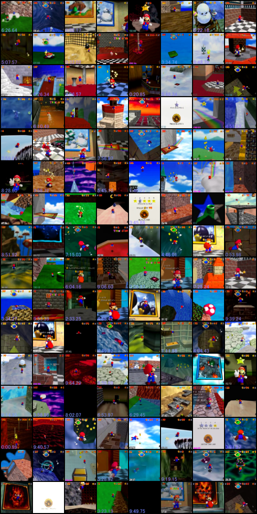</td>
  <thead> <th colspan="3"> Generated Images </th> </thead>
  <tr>
      <th>Epoch 50</th>
      <th>Epoch 70</th>
      <th>Epoch 90</th>
  </tr>
  <tr>
      <td align="center"> 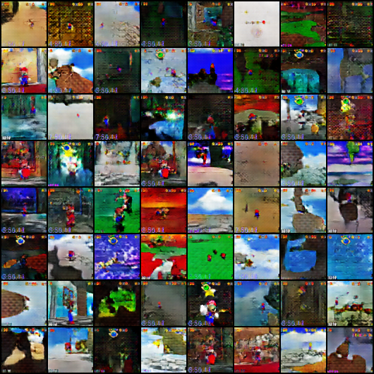 </td>
      <td align="center"> 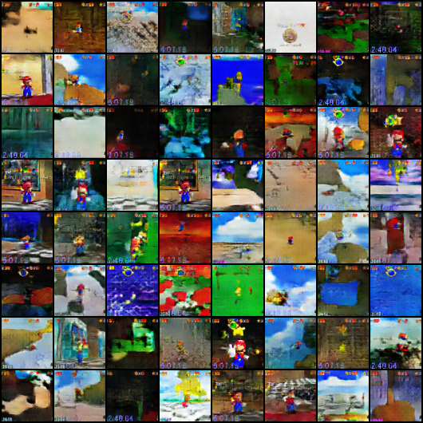 </td>
      <td align="center"> 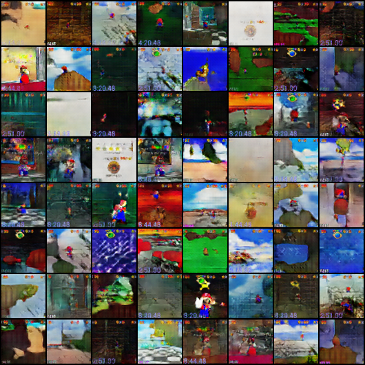 </td>
  </tr>
</table>

### 2nd Trained Model

More results are at [**output/GC7M**](output/GC7M)


- 1 million images (279 GB)
- 3 different players (images without star count removed)
- images are 88 by 66
- 8 epochs
- Generator 4.3m trainable parameters, Discriminator 3.8m trainable parameters


<table>
  <thead><th colspan="3">Training Batch</th></thead>
  <td colspan="3" align="center"> 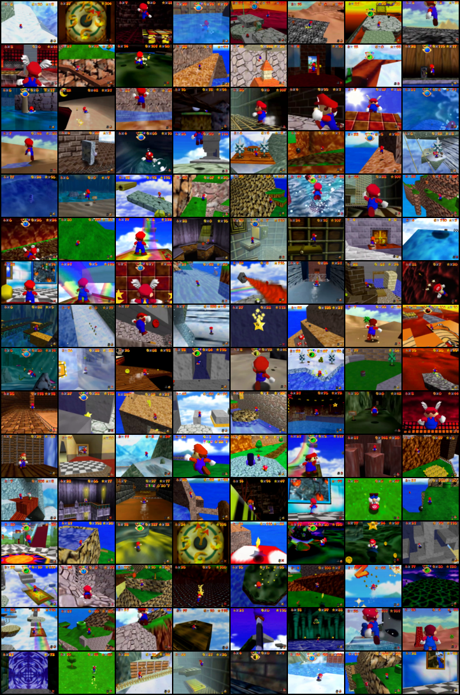 </td>
  <thead> <th colspan="3"> Generated Images </th> </thead>
  <tr>
    <th>Epoch 1</th>
    <th>Epoch 4</th>
    <th>Epoch 8</th>
  </tr>
  <tr>
    <td align="center"> 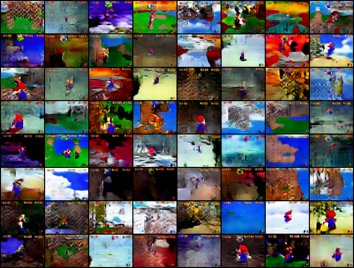 </td>
    <td align="center"> 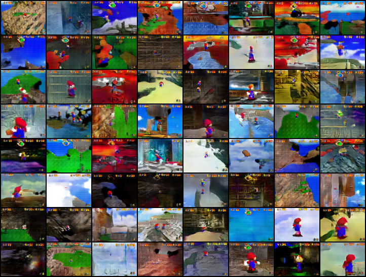 </td>
    <td align="center"> 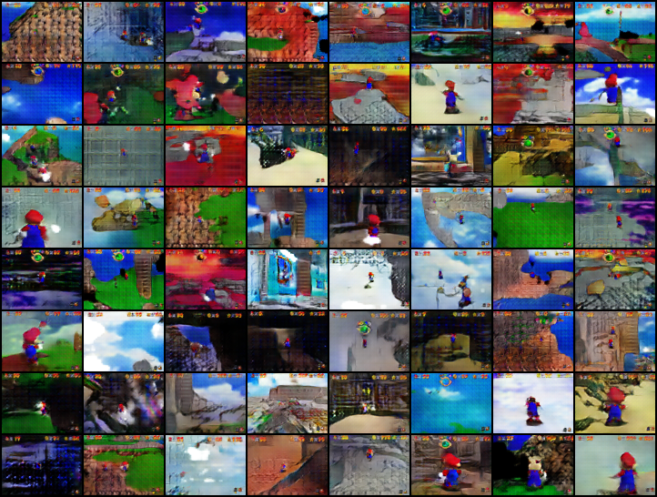 </td>
  </tr>
</table>

### 3rd Trained Model

More results are at [**output/3CK2**](output/3CK2)

- 1 million images (279 GB)
- 3 different players (images without star count removed)
- images are 88 by 66
- 9 epochs
- Generator 10.6m trainable parameters, Discriminator 5.9m trainable parameters

<table>
  <thead><th colspan="3">Training Batch</th></thead>
  <td colspan="3" align="center"> 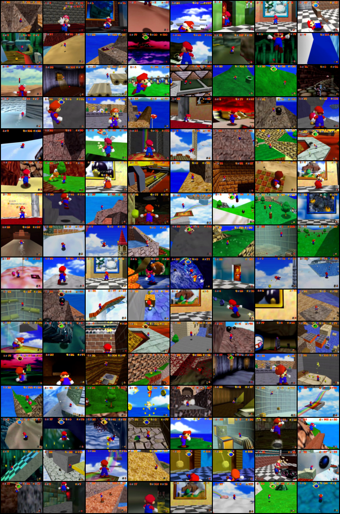 </td>
  <thead> <th colspan="3"> Generated Images </th> </thead>
  <tr>
    <th>Epoch 1</th>
    <th>Epoch 5</th>
    <th>Epoch 9</th>
  </tr>
  <tr>
    <td align="center"> 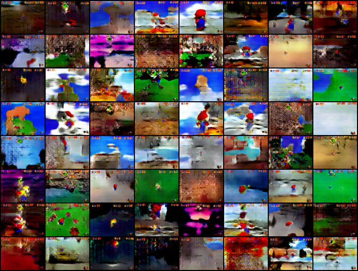 </td>
    <td align="center"> 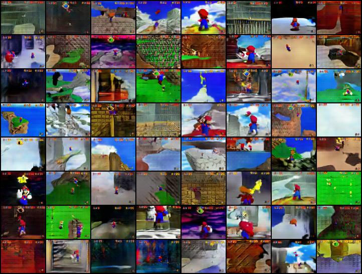 </td>
    <td align="center"> 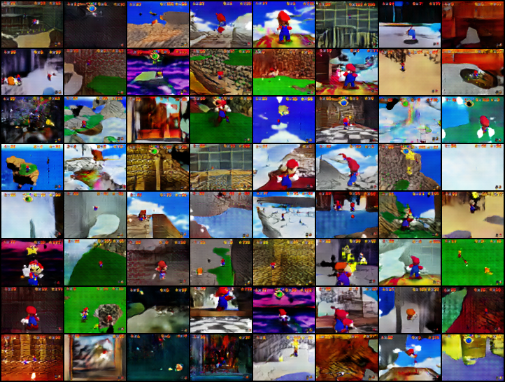 </td>
  </tr>
</table>

### 4th Trained Model

More results are at [**output/KDTI**](output/KDTI)

- 1 million images (279 GB)
- 3 different players (images without star count removed)
- images are 128 by 96
- 7 epochs
- Generator 3.4m trainable parameters, Discriminator 2.8m trainable parameters

<table>
  <thead><th colspan="3">Training Batch</th></thead>
  <td colspan="3" align="center"> 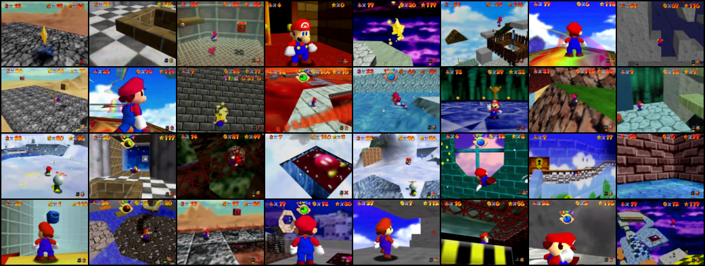 </td>
  <thead> <th colspan="3"> Generated Images </th> </thead>
  <tr>
    <th>Epoch 1</th>
    <th>Epoch 5</th>
    <th>Epoch 7</th>
  </tr>
  <tr>
    <td align="center"> 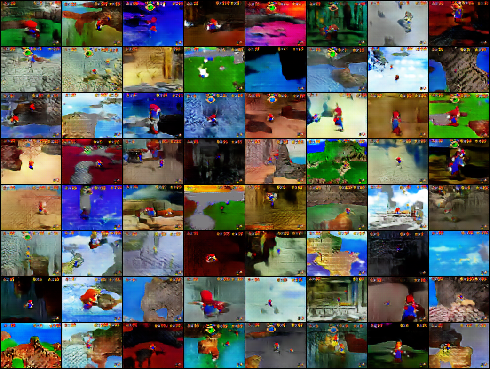 </td>
    <td align="center"> 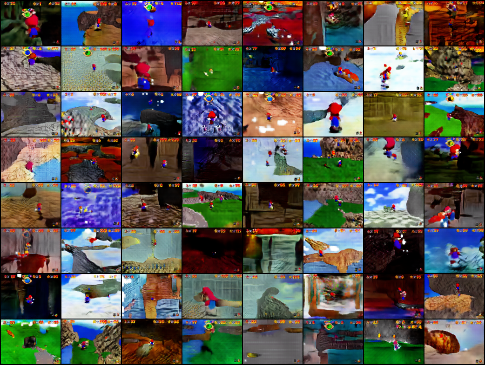 </td>
    <td align="center"> 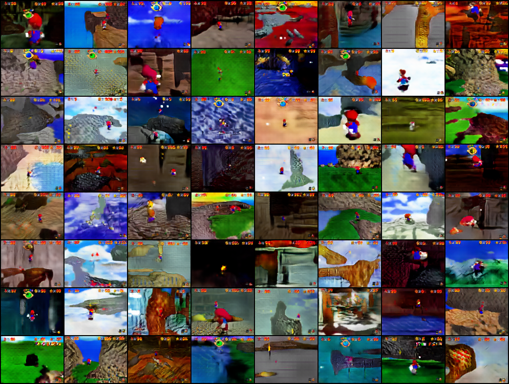 </td>
  </tr>
</table>

