# Game Image Generation
With this project, you can train a Generative Adversarial Network.  While this is a general image GAN framework, this repository focuses on generating fake game images.

## Requirements
- Python 3.6
- [Pytorch](https://pytorch.org/)
- [Pytorch-ignite](https://pytorch.org/ignite/index.html)
- [torchvision](https://pypi.org/project/torchvision/)
- [torchinfo](https://github.com/TylerYep/torchinfo)
- [torch-ema](https://github.com/fadel/pytorch_ema)
- [SciPy](https://scipy.org/install/)

## Running

From the parent folder, you can run this command to run with the DCGAN model
```
python3 -m src.train_gan configs/dcgan_128_96.ini
```

## Models supported
### [Biggan model](https://arxiv.org/pdf/1809.11096.pdf) and [Deep Biggan model](https://arxiv.org/pdf/1809.11096.pdf)

**configs/biggan_128_96.ini**

**configs/deep_biggan_128_96.ini**

- 4:3 Aspect ratio
- Images of size 128x96
- Batch size 32 - For best results, run with 2048, but this requires a lot of GPU VRAM
- ngf, ndf 32 - Change to 128 to improve, but the model will take much more VRAM and train slower

### DCGAN
Configuration: **configs/dcgan_128_96.ini**
- 4:3 Aspect ratio
- Images of size 128x96

## Configuration File


#### Loading and saving
- Model name - Name of the model to train or inference from.  Model can be found in the model directory.
- Model directory - Directory where the models are saved - defaults to **/models**

#### Data
- Train Directory - Images to train the model with.  Example data directory can be found in **data/coil-100**
- Base width - width of aspect ratio
- Base height - height of aspect ratio
- Upsample Layers - Used to get image height and width, adding 1 to upsample layers doubles the width and height.

$image Width = base Width * 2 ^ {upsample Layers}$

$image Height = base Height * 2 ^ {upsample Layers}$

#### Machine-specific parameters
- Number of GPUs

#### Model Architecture
- Type of model, possible options are [_deep-biggan_, _biggan_, _dcgan_].  Default parameters for these models will automatically be loaded.  Default configurations for each model can be found in the models directory _src/models/[model_type]/defaults.ini_

## Images Generated

These models are trained from images that are collected from people speedrunning the game Super Mario 64


### 1st Trained Model

More results are at [**models/Y8Q8**](models/Y8Q8)


- 47,000 images (6.6 GB)
- 120 star speedruns of 8 different players
- images are 64 by 64
- 150 epochs

<table>
  <thead><th colspan="3">Training Batch</th></thead>
  <td colspan="3" align="center">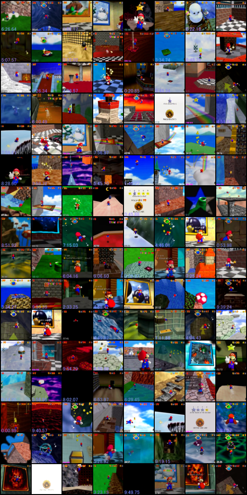</td>
  <thead> <th colspan="3"> Generated Images </th> </thead>
  <tr>
      <th>Epoch 50</th>
      <th>Epoch 70</th>
      <th>Epoch 90</th>
  </tr>
  <tr>
      <td align="center"> 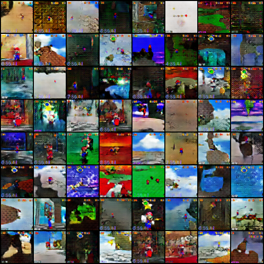 </td>
      <td align="center"> 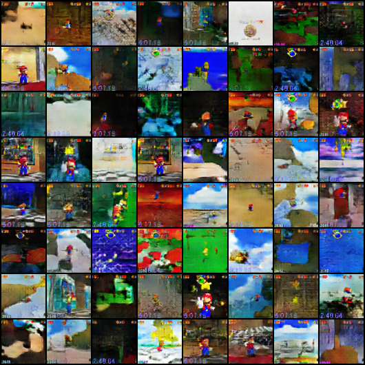 </td>
      <td align="center"> 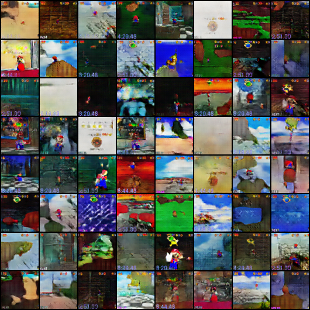 </td>
  </tr>
</table>

### 2nd Trained Model

More results are at [**models/GC7M**](models/GC7M)


- 1 million images (279 GB)
- 3 different players (images without star count removed)
- images are 88 by 66
- 8 epochs
- Generator 4.3m trainable parameters, Discriminator 3.8m trainable parameters


<table>
  <thead><th colspan="3">Training Batch</th></thead>
  <td colspan="3" align="center"> 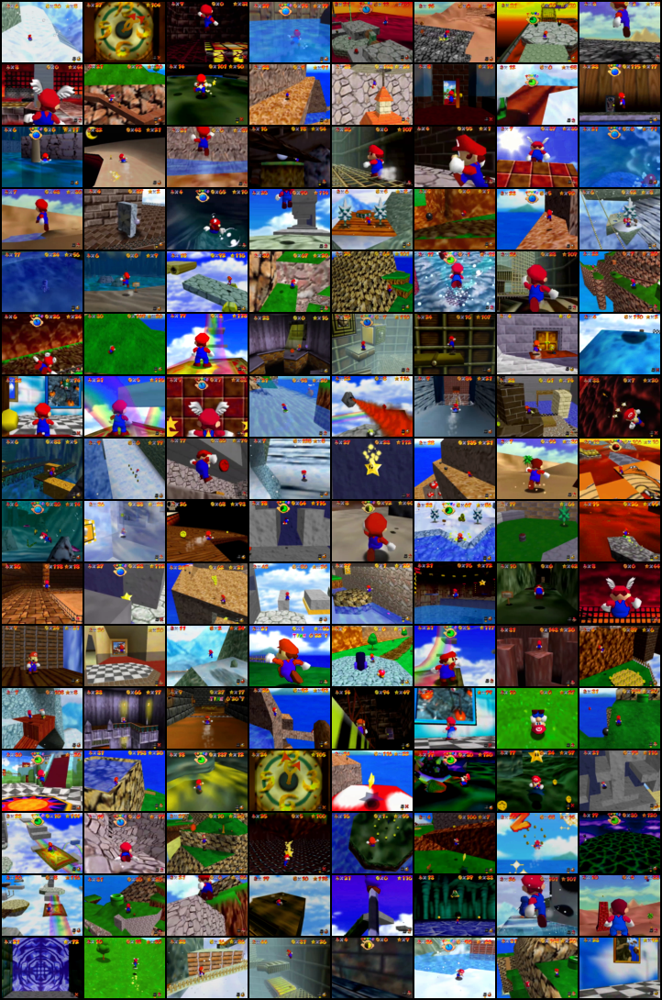 </td>
  <thead> <th colspan="3"> Generated Images </th> </thead>
  <tr>
    <th>Epoch 1</th>
    <th>Epoch 4</th>
    <th>Epoch 8</th>
  </tr>
  <tr>
    <td align="center"> 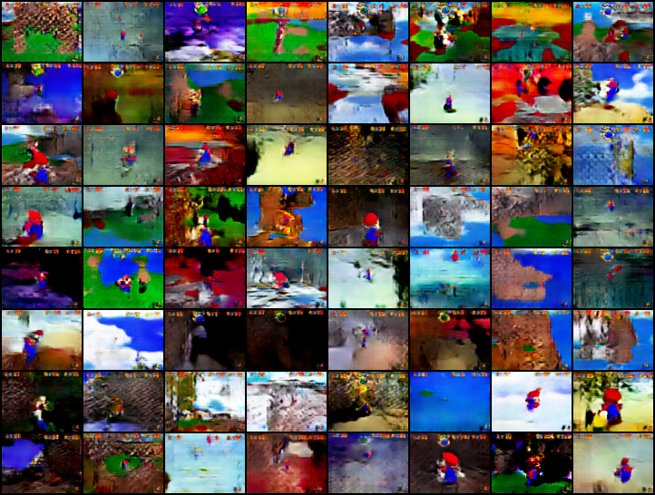 </td>
    <td align="center"> 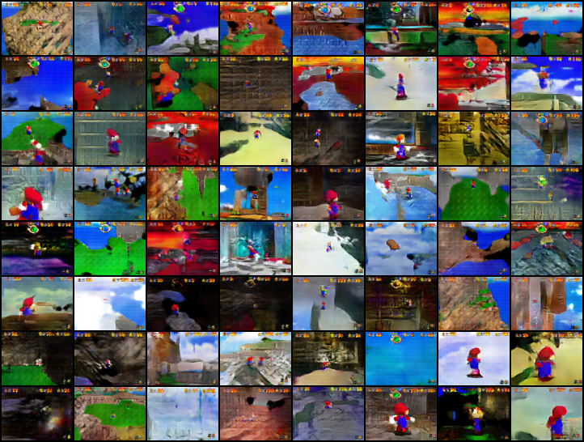 </td>
    <td align="center"> 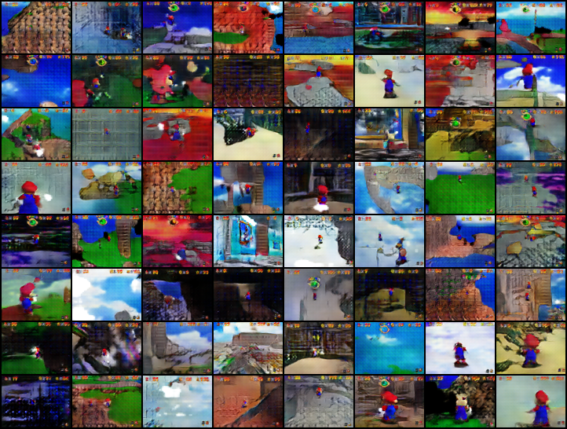 </td>
  </tr>
</table>

### 3rd Trained Model

More results are at [**models/3CK2**](models/3CK2)

- 1 million images (279 GB)
- 3 different players (images without star count removed)
- images are 88 by 66
- 9 epochs
- Generator 10.6m trainable parameters, Discriminator 5.9m trainable parameters

<table>
  <thead><th colspan="3">Training Batch</th></thead>
  <td colspan="3" align="center"> 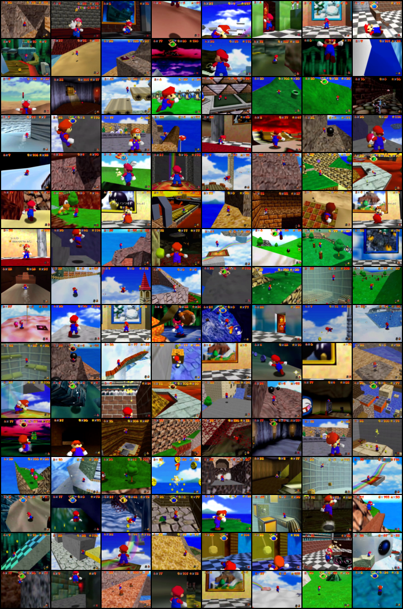 </td>
  <thead> <th colspan="3"> Generated Images </th> </thead>
  <tr>
    <th>Epoch 1</th>
    <th>Epoch 5</th>
    <th>Epoch 9</th>
  </tr>
  <tr>
    <td align="center"> 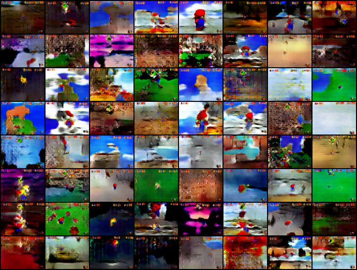 </td>
    <td align="center">  </td>
    <td align="center"> 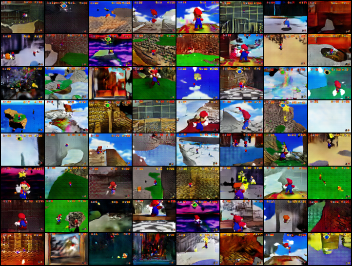 </td>
  </tr>
</table>

### 4th Trained Model

More results are at [**models/KDTI**](models/KDTI)

- 1 million images (279 GB)
- 3 different players (images without star count removed)
- images are 128 by 96
- 7 epochs
- Generator 3.4m trainable parameters, Discriminator 2.8m trainable parameters

<table>
  <thead><th colspan="3">Training Batch</th></thead>
  <td colspan="3" align="center"> 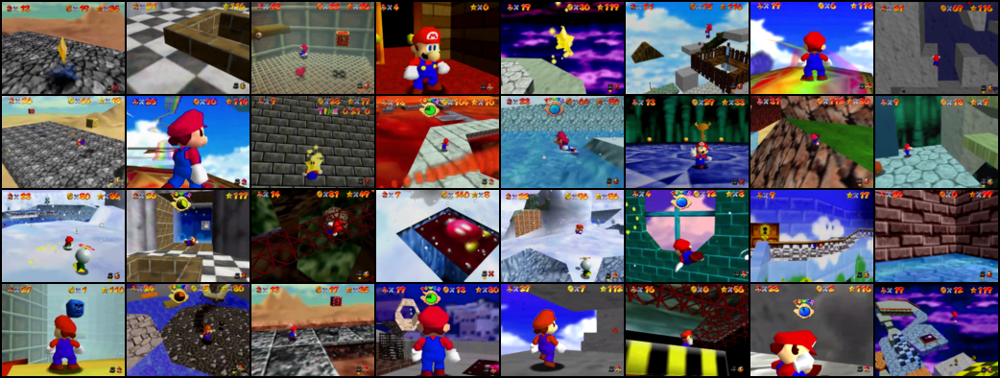 </td>
  <thead> <th colspan="3"> Generated Images </th> </thead>
  <tr>
    <th>Epoch 1</th>
    <th>Epoch 5</th>
    <th>Epoch 7</th>
  </tr>
  <tr>
    <td align="center"> 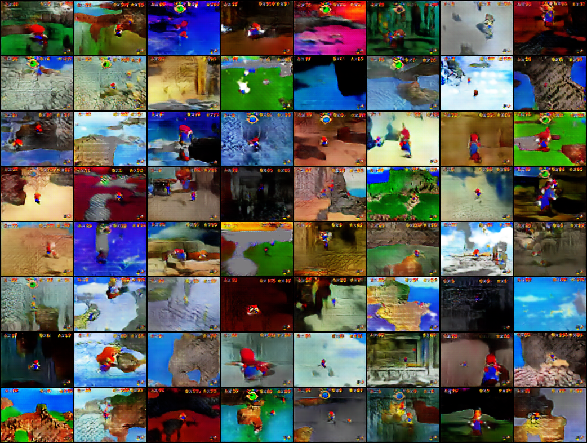 </td>
    <td align="center"> 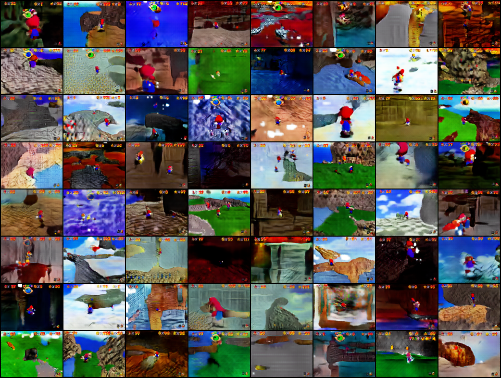 </td>
    <td align="center"> 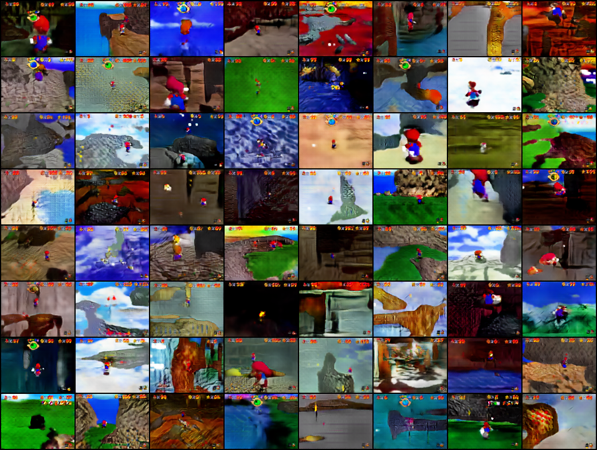 </td>
  </tr>
</table>

